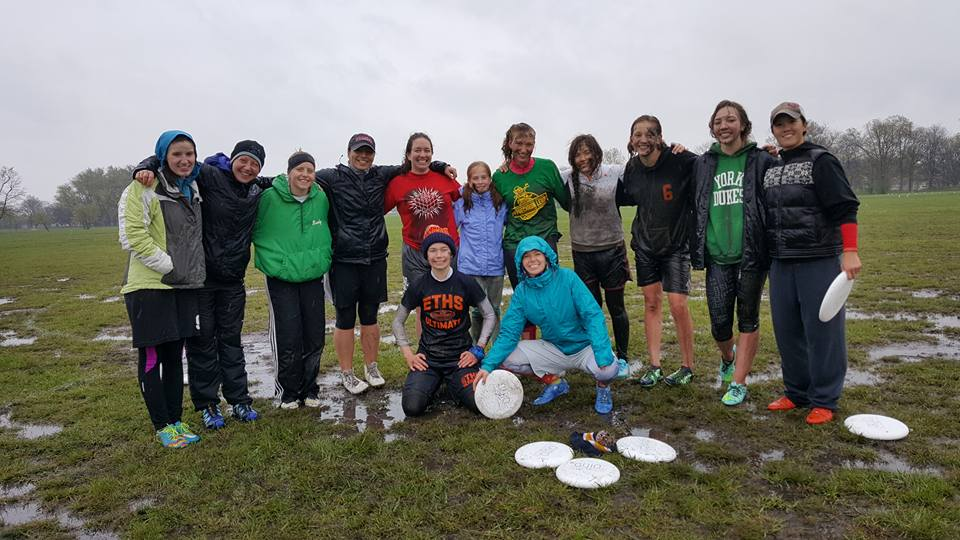

***

Outline
=====
* Munge
    + When possible, data was pulled straight from the raw data files and assigned codes in R. When not possible, data was pulled from hand-coded data source
    + Predictor variable from raw: `age`, `where_live`, `team`, `currently_playing`, `how_long_play`, `start_playing`, `first_experience`
    + Predictor variables derived: `team_type` (derived from team), `club_or_not` (derived from team type)
    + Response variables: `satis_amount_recode`, `satis_level_recode`, `conn_club`, `conn_recreational`, `conn_college`, `conn_youth`, `inclus_UC`, `inclus_college`, `inclus_women`, `inclus_mixed` 
    + Response variables derived: `satis_combined` (sum of satisfaction), `conn_combined` (sum of connectedness), `inclus_combined` (sum of inclusiveness), `overall` (sum of sums)
* Plot
    + Focused on showing the effect of `team_type` outcome variables as it was the best predictor of all the independent variables
    + A limitation of our data is that we only collected non-continuous data in both predictor and response variables. For that reason, all of the point plots are "jittered" (random noise introduced) so that they're a bit more visually interpretable. 
* Model
    + Ordered Logistic/Probit Regressions for ordered categorical response variables
    + OLS regression for summed categorical response variables
    + Only looking at main effects for now, no interations
* Main takeaway
    + `team_type` was a significant predictor of general happiness with ultimate in Chicago. Nothing else was really significant.
    + Directionality: Non-club players feel less satisfied, connected, and included than club players
    + There isn't a significant difference between how happy/satisfied women's players and mixed players feel


***

 

***

<br /><br /><br />

***

## Munge

```{r setup, include=FALSE}
knitr::opts_chunk$set(echo = FALSE, warning = FALSE, message = FALSE)

source("./munge.R")
# source("./model.R")
source("./summary_stats.R")

```

* Categorize teams into 
    + a variable `team_type` with three levels: `mixed`, `no_club`, and `womens`. All players not on a womens or mixed team are `no_club` (which is a little misleading because this encompasses non-Chicago club teams)
    + a variable `club_or_not` with two levels: `club` and `not_club`

* When the outcome variable is an ordered factor (e.g., "How satisfied are you with the AMOUNT of ultimate you are currently playing?")
    + Run an ordered probit regression with some number of predictor variables
predicting that single outcome variable

* Combine ordered categorical predictor variables into omnibus variables and treat them as continuous
    + The idea with summing ordinal response variables was to introduce more degrees of freedom into the outcome variable so that we could run a more standard linear regression rather than an ordered/logistic probit regression on each outcome variable. It hopefully gives us both more predictive power and a more holistic look at three main categories of response variable (satisfaction, connectedness, and inclusiveness)

Caveat: while directionality is constant across different variables (i.e., 1 always = bad or disagree or whatever), there are different levels for different variables that aren't necessarily comparable. They're ordered in
a way that makes the most sense, I think, but you could definitely argue for a different ordering. 

For example, for the question "How satisfied are you with the AMOUNT of ultimate you are currently playing?", is this the right ordering? 

Not satisfied: wants more < Not satisfied: wants less < Neutral < Other < Somewhat satisfied: wants more < Somewhat satisfied: wants less < Very satisfied      

`¯\_(ツ)_/¯`

Something to try here might be to take out all the Others and relevel. Or combine things like "Not satisfied: wants more" and "Not satisfied: wants less" into the same level.

<br /><br /><br />


***
## Summary Stats

Variables considered

```{r}
kable(predictor_tbl)

kable(outcome_tbl)

```

First 5 responses shown

```{r}
knitr::kable(head(dat[, 1:ncol(dat)]))
```


Outcome vars: means by team ordered by overall

```{r}

kable(means.by.team)

```


Team type

```{r}
knitr::kable(n_by_team_type, col.names = c("Team Type", "Number of Respondents"))
```

<br /><br /><br />

      
***
## Some Charts

Basic breakdowns


```{r}
graph_table <- function(summarise_this) {
  ggplot(data = na.omit(all), aes_string(summarise_this)) + geom_bar(position = "dodge")
}

graph_table("team_type")
graph_table("club_or_not")

```

```{r}
graph_table("team")
```


What people are playing by their team 

* Note that many people took the survey after their seasons had ended so what they play in season might != what they said they were `currently_playing`

```{r}
currently_playing.team_type <- ggplot(data = na.omit(all)) +
  geom_bar(aes(currently_playing, fill = team)) + 
  theme(axis.text.x = element_text(angle = 60, hjust = 1)) +
  ggtitle("Where We Play by Team") +
  labs(x = "Where Play", y = "Count")
currently_playing.team_type
```

<br>

Satisfaction with amount playing faceted by team type
```{r}
team_type_names <- list(
  "no_club" = "No Club",
  "mixed" = "Mixed",
  "womens" = "Womens"
)

# function to return the values of facet labels. called inside facet_grid()
relabel_t_t <- function(variable, value){
  return(team_type_names[value])
}

ggplot(na.omit(all)) +
  geom_bar(aes(x = satis_amount_recode,
               y = (..count..)/sum(..count..),
               position = "dodge")) +
  facet_grid(. ~ team_type, labeller = relabel_t_t) +
  theme(axis.text.x = element_text(angle = 60, hjust = 1)) +
  ggtitle("Satisfaction with Amount of Play by Team Type") +
  labs(x = "Satisfaction with Amount of Play", y = "Proportion of Total Sample")
```


<br>

Jittered `age` (ordinal) vs. overall happiness w/ boxplot of `overall` superimposed
```{r overall.team_type, echo = FALSE, warning=FALSE, message=FALSE}

qplot(age, overall, data = all) +
  geom_jitter() +
  geom_boxplot(alpha = 0.3) +
  ggtitle("Overall Happiness by Age Group") +
  labs(x = "Age (Jittered)", y = "Overall Happiness")
```


<br><br>

#### Drilling down into team_type

Non-Club: How long have non-Chicago club players been playing?
```{r}
no_club.how_long_play <- 
  ggplot(data = na.omit(all[all$team_type == "no_club", ])) +
  geom_bar(aes(team, fill = how_long_play), position = "fill") + 
  theme(axis.text.x = element_text(angle = 60, hjust = 1)) +
  scale_y_continuous(labels = scales::percent) +
  ggtitle("Among Non-Chicago Club Players: Length of Time Playing by Team") +
  labs(x = "Team", y = "Percent")
no_club.how_long_play
```

Womens: age predicting overall happiness

(Best fit lines are fitted using the linear `method = "lm"`)

```{r}
# (Careful of the nemesis outlier (only Nemesis player with `age`==4))
ggplot(all[all$team_type == "womens", ],
       aes(x = as.numeric(age), y = overall, colour = team)) + 
  geom_jitter() +
  geom_smooth(method = "lm", se = FALSE)
```

<br>

Mixed: where you started playing predicting overall satisfaction
```{r}
ggplot(all[all$team_type == "mixed", ],
       aes(x = as.numeric(start_playing), y = overall, colour = team)) + 
  geom_jitter() +
  geom_smooth(method = "lm", se = FALSE)
```


<br><br>

#### Satisfaction Amount by Team Type
* Focusing on amount rather than level because the model showed `team_type` predicting satisfaction amount but not level. 
* (In other words, what kind of team you're on has an effect on whether you're satisfied with the amount you're playing or not.)

```{r}
ggplot(na.omit(all[all$team_type=="womens", ])) + 
  geom_bar(aes(x = satis_amount_recode, y = (..count..)/sum(..count..),
               position = "fill")) +
  labs(title = "Satisfaction with Amount of Play: Womens") +
  scale_y_continuous(labels = scales::percent) +
  scale_x_discrete(drop=FALSE) +     # don't drop unused levels
  theme(axis.text.x = element_text(angle = 60, hjust = 1))
```

```{r}
ggplot(na.omit(all[all$team_type=="mixed", ])) + 
  geom_bar(aes(x = satis_amount_recode, y = (..count..)/sum(..count..),
               position = "fill")) +
  labs(title = "Satisfaction with Amount of Play: Mixed") +
  scale_y_continuous(labels = scales::percent) +
  scale_x_discrete(drop=FALSE) +
  theme(axis.text.x = element_text(angle = 60, hjust = 1))
```

```{r}
ggplot(na.omit(all[all$team_type=="no_club", ])) + 
  geom_bar(aes(x = satis_amount_recode, y = (..count..)/sum(..count..),
               position = "fill")) +
  labs(title = "Satisfaction with Amount of Play: Non-Club Players") +
  scale_y_continuous(labels = scales::percent) +
  scale_x_discrete(drop=FALSE) +
  theme(axis.text.x = element_text(angle = 60, hjust = 1))


```

<br /><br /><br />

***
## Cluster Analyses


### K-Means clustering

Dependent variable here is `overall` happiness.

Hypothesis: 

* Unsupervised clustering into two groups --> fault line will be the `club` vs. `no_club` divide. 
* Into three groups --> clusters will mainly represent the three `team_type`s

Setup:

* Pare down the data to only the outcome variable, `overall`, and the predictor variables `age`, `where_live`, `currently_playing`, `how_long_play`, `start_playing`, and `first_experience`. So we take out `team`, `team_type`, and `club_or_not` because these are implicated in the hypothesis
* Set a kmeans algorithm on the new data  
  + Tell the algorithm we want it to cluster the data into two clusters based on the outcome variable
  + Glue this output (a series of 1 and 2s depending on which cluster each row was assigned to) along with the team varibles we took out all back together
* Data is jittered for interpretability
  

```{r kmenas_setup, include=FALSE}

# get a dataset with only complete cases
all_no_na <- all[complete.cases(all), ]

# remove the one row with a missing value
# keep only predictor vars (not outcome vars) that aren't team and team_type (because that's what we think
# will determine in some part which clusters people fall into)
cluster_dat <- all[complete.cases(all), ] %>% 
  select(
    age, where_live, currently_playing, how_long_play, start_playing, first_experience,
    overall
  )

# from the pared dataset, cluster people based on their "overall" ratings in first
# two, then three clusters.
# this returns an objet of class kmeans. do str(clusters_two) to see what's in here.
set.seed(10) # for reproducibility
clusters_two <- kmeans(cluster_dat$overall, centers = 2, iter.max = 15, nstart = 20)
clusters_three <- kmeans(cluster_dat$overall, centers = 3, iter.max = 15, nstart = 20)


# cbind the cluster portion of these two the df with no NAs, plus the variables that had team indicators (i.e.,
# club_or_not, team_type, and team) that we had taken out originally
cluster_dat <- as_tibble(data.frame(cluster_dat, 
                          club_or_not = all_no_na$club_or_not,
                          team_type = all_no_na$team_type,
                          team = all_no_na$team,
                          clusters_two = factor(clusters_two$cluster),
                          clusters_three = factor(clusters_three$cluster)))

```


Colored by two clusters.

```{r}
ggplot(data = cluster_dat,    
       aes(x = club_or_not, y = overall, colour = clusters_two)) + 
  geom_jitter() +
  ggtitle("Unsupervised Clustering of Overall Scores into Two Groups") +
  labs(x = "Team Type", y = "Overall Happiness") +
  # geom_boxplot(alpha = 0.3) +
  theme_minimal()
```

Colored by two clusters.

```{r}
ggplot(data = cluster_dat,    
       aes(x = team_type, y = overall, colour = clusters_two)) + 
  geom_jitter() +
  ggtitle("Unsupervised Clustering of Overall Scores into Two Groups") +
  labs(x = "Team Type", y = "Overall Happiness") +
  # geom_boxplot(alpha = 0.3) +
  theme_minimal()
```


Colored by three clusters.

```{r}
ggplot(data = cluster_dat,    
       aes(x = team_type, y = overall, colour = clusters_three)) + 
  geom_jitter() +
  ggtitle("Unsupervised Clustering of Overall Scores into Three Groups") +
  labs(x = "Team Type", y = "Overall Happiness") +
  # geom_boxplot(alpha = 0.3) +
  theme_minimal()
```

A plot of how `team_type` falls into the two clusters. 
```{r}
ggplot(data = cluster_dat, 
       aes(x = clusters_two, y = overall, colour = team_type)) + 
  geom_jitter() +
  ggtitle("Unsupervised Clustering of Overall Scores into Two Groups") +
  labs(x = "Cluster", y = "Overall Happiness") +
  theme_minimal()
```


The same with boxplots overlaid

```{r}
ggplot(data = cluster_dat, 
       aes(x = clusters_two, y = overall, colour = team_type)) + 
  geom_jitter() +
  ggtitle("Unsupervised Clustering of Overall Scores into Two Groups") +
  labs(x = "Cluster", y = "Overall Happiness") +
  geom_boxplot(alpha = 0.3) +
  theme_minimal()
```


A plot of how `club_or_not` falls into the three clusters.

```{r}
ggplot(data = cluster_dat, 
       aes(x = clusters_three, y = overall, colour = club_or_not)) + 
  geom_jitter() +
  ggtitle("Unsupervised Clustering of Overall Scores into Two Groups") +
  labs(x = "Cluster", y = "Overall Happiness") +
  theme_minimal()
```

With team as the grouper

```{r}
ggplot(data = cluster_dat, 
       aes(x = clusters_two, y = overall, colour = team)) + 
  geom_jitter() +
  ggtitle("Unsupervised Clustering of Overall Scores into Two Groups") +
  labs(x = "Cluster", y = "Overall Happiness") +
  # geom_boxplot(data = all_no_team_indics, aes(overall)) +
  theme_minimal()
```


<br /><br />

### Hierarchical Clustering

* Dependent vars: satisfaction amount and satisfaction level
* Grouping vars: `team`, `team_type`, or `where_live`
* Distance = Euclidian
* Method = centroid


```{r}
hc <- all %>%
  group_by(team) %>% 
  summarise(
    s_amount = mean(as.numeric(satis_amount_recode)), 
    s_level = mean(as.numeric(satis_level_recode))
  )

# put team names as rownames and take out the team column
hc <- data.frame(hc)
rownames(hc) <- hc[["team"]]
hc <- as_tibble(hc[, 2:ncol(hc)])

# scale the variables of interest (everything except team, which was included in the group_by)
scale_vars <- function(dat) {
  vars <- dat[, 1:ncol(dat)]
  for (row in vars) {
    var_scaled <- scale(row)
    dat <- data.frame(dat, var_scaled = var_scaled)
  }
  dat
}
hc <- scale_vars(hc)

# change the new names to something meaningful (try to get this in the function)
names(hc)[3:4] <- c("s_amount_scaled", "s_level_scaled")

hc_dist <- dist(hc[3:4])
hc_fit <- hclust(hc_dist, method = "centroid")
```


Plot the heirarchy
```{r}
plot(hc_fit, hang = -1, cex = 0.8, srt = 60,
     main = paste0("Cluster based on Satisfaction Amount and Satisfaction Level Per Team"),
     xlab = "Groups", 
     ylab = "")
```


<br>

Optimal number of clusters? Depends on many factors, but somewhere around 3 or 4, usually.
```{r}
# # get optimal number of clusters
# num_clust <- NbClust(hc[3:4], min.nc = 2,
#                      max.nc = 8,   # set max number of clusters to less than number of groups
#                      method = "centroid")
```


<br /><br /><br />

***
## Models

Omnibus model with all predictors predicting the overall measure. (Not including `team` here because it is binned by `team_type`)

```{r m.big, echo=FALSE}

m.big <- lm(overall ~ 
            age + team_type + 
            currently_playing + 
            how_long_play + 
            start_playing +
            where_live,
            data = all)
```

``` {r}
summary(m.big)
```

* So `team_type` is really the only good predictor

<br>

Drilling down into `team`, what's driving the dissatisfaction among `no_club` players?

* People who don't play any club at all (p = 0.00112)
```{r}
m.team <- lm(overall ~ 
              team,
            data = all)
summary(m.team)
```

<br><br>

* All other models with a single predictor variable predicting `overall` were not significant.

<br><br>

#### Satisfaction Measures

What about the effect of team type on satisfaction of just the **level** of ultimate you're playing?  

* Make two models, one with `team_type` as a predictor and one without
```{r, echo=FALSE}
library(ordinal)

# ------- with team_type and age predicting satis_level_recode --------
m.satis_level_team_t <- clm(satis_level_recode ~ team_type + age,
                link = "probit",
                       data = all)

# take out team type
m.satis_level_no.team_t <- clm(satis_level_recode ~ age,
                   link = "probit",
                       data = all)
```

<br> 

* Compare the performance of the models in predicting satisfaction level
* The model with team type does't predict satisfaction level better than the one without it (p = 0.6361). 
* So team_type is not a significant predictor of satisfaciton with the level of ultimate you're playing.
```{r}
anova(m.satis_level_team_t, m.satis_level_no.team_t)
```

<br> 

What about satisfaction with the **amount** of ultimate you're playing?

* Same procedure

```{r }
# ------- with team_type and age predicting satis_amount_recode ------- 
m.sais_amount_team_t <- clm(satis_amount_recode ~ team_type + age,
                link = "probit",
                data = all)
m.sais_amount_no.team_t <- clm(satis_amount_recode ~ age,
                   link = "probit",
                   data = all)
```

<br>

Model with team type *does* predict satisfaction level better than the one without it (p = 0.0072)
```{r}
anova(m.sais_amount_team_t, m.sais_amount_no.team_t)
```

<br>

Okay so there's a there there with `team_type`. So does `team_type` pedict overall satisfaction, inclusion, connection, and all of the above?

<br>
**Do womens and mixed players have significantly higher overall satisfaction, connectedness, and inclusion than non-club players?**

Satisfaction: yes (p = 0.0252)
```{r}
m.satis_combined.team_type <- lm(satis_combined ~ team_type,
                       data = all)
summary(m.satis_combined.team_type)
```

Connection: yes (p = 1.17e-07)
```{r}
m.conn_combined.team_type <- lm(conn_combined ~ team_type,
                                 data = all)
summary(m.conn_combined.team_type)
```

Inclusion: yes (p = 0.00245)
```{r}
m.inclus_combined.team_type <- lm(inclus_combined ~ team_type,
                                 data = all)
summary(m.inclus_combined.team_type)
```

Overall: yes (p = 2.82e-07)
```{r}
m.overall.team_type <- lm(overall ~ team_type,
                                  data = all)
summary(m.overall.team_type)
```

<br>

Is there a significant difference in combined satisfaction and inclusion scores between womens and mixed players?
No, p = 0.841

```{r}
womens_and_mixed.m.overall.team_type <- lm(overall ~ team_type,
                                            data = all[all$team_type %in% c("womens", "mixed"), ])
summary(womens_and_mixed.m.overall.team_type)

```

<br>

So, narrowing down to club or not, is playing club at all a significant predictor of overall happiness with ultimate in Chicago?

```{r}
library(ggthemes)
overall.club_or_not <- ggplot() +
  geom_density(data = all_present, aes(x = overall, fill = `Club or Not`), position = "dodge",
               alpha = 0.5) +
  ggtitle("Club participation predicting overall happiness") +
  labs(x = "Overall Happiness", y = "Density") +
  theme_minimal()
overall.club_or_not
```

<br>

Yes, p = 2.32e-09
```{r}
m.overall.club_or_not <- lm(overall ~ club_or_not,
                          data = all)
summary(m.overall.club_or_not)
```


<br><br><br>


 

<br><br><br>


#### Future directions
* Merge with overall stats of where people are playing
* Merge with qualitative dat
* Check goodness of fit of models


<br><br><br>


