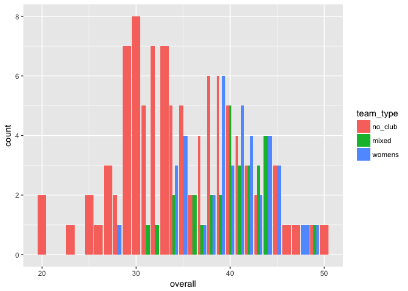
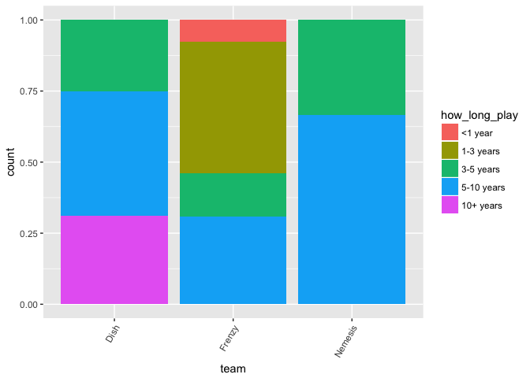
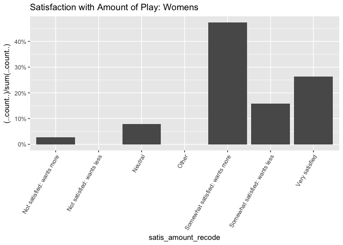
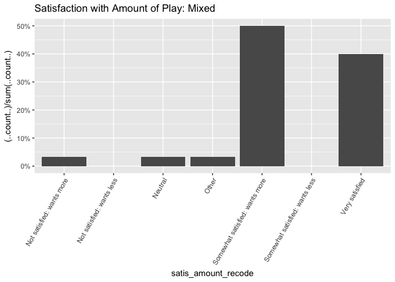
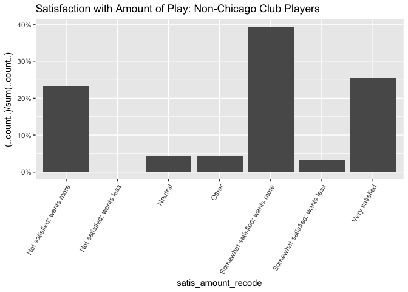

# Women in Chicago Ultimate Data Analysis

***

Outline
=====
* About:
    + Survey distributed by Steph Landry
* Models:
    + Ordered Logistic/Probit Regressions for ordered categorical variables
    + OLS regression for summed categorical variables
* Plots:
    + Many

***

 

***

<br /><br /><br />

## Munge


* Break teams into 
+ a variable `team_type` with three levels: mixed, no_club, and womens
+ a variable `club_or_not` with two levels: club and not_club

* When the outcome variable is an ordered factor (e.g., "How satisfied are you with the AMOUNT of ultimate you are currently playing?")
+ Run an ordered probit regressions with some number of predictor variables
predicting that single outcome variable

* Combine categorical variables into omnibus variables  

  + These omnibus variables are more continuous so treat them as 
  + Caveat: while directionality is constant across different variables (i.e., 1 always = bad, disagree), there are different levels for different variables that aren't necessarily comparable. They're ordered in
a way that makes the most sense, I think, but you could definitely argue for a different ordering. For example, for the question "How satisfied are you with the AMOUNT of ultimate you are currently playing?", is this the right ordering? 

"Not satisfied: wants more" < "Not satisfied: wants less" < "Neutral" < "Other" < "Somewhat satisfied: wants more" < "Somewhat satisfied: wants less" < "Very satisfied"      

¯\_(ツ)_/¯

          


## Some Visuals

<!-- --><!-- --><!-- -->

```
## Warning: Ignoring unknown aesthetics: position
```

<!-- -->

```
## Warning: Ignoring unknown aesthetics: position
```

<!-- -->

```
## Warning: Ignoring unknown aesthetics: position
```

<!-- -->


```
## 
## Call:
## lm(formula = overall ~ age + team + currently_playing + how_long_play, 
##     data = all)
## 
## Residuals:
##      Min       1Q   Median       3Q      Max 
## -12.8293  -3.3954   0.1984   3.5743  11.9237 
## 
## Coefficients:
##                      Estimate Std. Error t value Pr(>|t|)    
## (Intercept)         38.999639   1.583218  24.633  < 2e-16 ***
## age.L               -2.084366   2.695407  -0.773  0.44067    
## age.Q               -0.174121   2.154334  -0.081  0.93570    
## age.C                0.945238   1.562446   0.605  0.54619    
## age^4               -2.143812   1.171242  -1.830  0.06935 .  
## age^5                0.690985   0.995690   0.694  0.48886    
## teamELevate         -0.474858   2.239260  -0.212  0.83237    
## teamFrenzy           0.387873   2.143149   0.181  0.85665    
## teamNo-Club         -4.814305   1.541152  -3.124  0.00218 ** 
## teamNon-Chicago     -2.473522   2.276016  -1.087  0.27903    
## teamJabba The Huck   2.473321   3.245479   0.762  0.44731    
## teamNemesis          1.826261   2.381995   0.767  0.44457    
## teamOther           -6.273270   2.990910  -2.097  0.03778 *  
## teamShakedown        0.210251   2.706551   0.078  0.93819    
## teamStack Cats       1.005137   2.613886   0.385  0.70117    
## teamUPA              0.906854   3.421555   0.265  0.79137    
## currently_playing.L  0.549627   1.063641   0.517  0.60616    
## currently_playing.Q -0.076303   1.130031  -0.068  0.94626    
## currently_playing.C  0.180175   1.125845   0.160  0.87309    
## currently_playing^4  0.006071   1.159435   0.005  0.99583    
## currently_playing^5 -2.196728   1.216930  -1.805  0.07323 .  
## how_long_play.L      1.137044   1.780441   0.639  0.52412    
## how_long_play.Q     -0.360362   1.429918  -0.252  0.80140    
## how_long_play.C      0.117622   1.174223   0.100  0.92035    
## how_long_play^4     -2.507431   0.997743  -2.513  0.01312 *  
## ---
## Signif. codes:  0 '***' 0.001 '**' 0.01 '*' 0.05 '.' 0.1 ' ' 1
## 
## Residual standard error: 5.339 on 138 degrees of freedom
##   (1 observation deleted due to missingness)
## Multiple R-squared:  0.3175,	Adjusted R-squared:  0.1988 
## F-statistic: 2.675 on 24 and 138 DF,  p-value: 0.0001825
```

```
## 
## Attaching package: 'ordinal'
```

```
## The following object is masked from 'package:dplyr':
## 
##     slice
```

```
## Likelihood ratio tests of cumulative link models:
##  
##             formula:                             link:  threshold:
## m.no.team_t satis_level_recode ~ age             probit flexible  
## m.team_t    satis_level_recode ~ team_type + age probit flexible  
## 
##             no.par    AIC  logLik LR.stat df Pr(>Chisq)
## m.no.team_t      9 401.10 -191.55                      
## m.team_t        11 404.19 -191.10  0.9048  2     0.6361
```

```
## Likelihood ratio tests of cumulative link models:
##  
##             formula:                              link:  threshold:
## m.no.team_t satis_amount_recode ~ age             probit flexible  
## m.team_t    satis_amount_recode ~ team_type + age probit flexible  
## 
##             no.par    AIC  logLik LR.stat df Pr(>Chisq)   
## m.no.team_t     10 480.57 -230.29                         
## m.team_t        12 474.71 -225.35  9.8677  2   0.007199 **
## ---
## Signif. codes:  0 '***' 0.001 '**' 0.01 '*' 0.05 '.' 0.1 ' ' 1
```

```
## 
## Call:
## lm(formula = satis_combined ~ team_type, data = all)
## 
## Residuals:
##     Min      1Q  Median      3Q     Max 
## -8.4333 -1.4333  0.5667  1.8830  3.8830 
## 
## Coefficients:
##             Estimate Std. Error t value Pr(>|t|)    
## (Intercept)  10.9251     0.2274  48.051   <2e-16 ***
## team_type.L   0.7835     0.3467   2.260   0.0252 *  
## team_type.Q  -0.6224     0.4359  -1.428   0.1552    
## ---
## Signif. codes:  0 '***' 0.001 '**' 0.01 '*' 0.05 '.' 0.1 ' ' 1
## 
## Residual standard error: 2.597 on 161 degrees of freedom
## Multiple R-squared:  0.05091,	Adjusted R-squared:  0.03912 
## F-statistic: 4.318 on 2 and 161 DF,  p-value: 0.0149
```

```
## 
## Call:
## lm(formula = conn_combined ~ team_type, data = all)
## 
## Residuals:
##     Min      1Q  Median      3Q     Max 
## -7.1750 -2.1898 -0.2045  1.8250  7.7660 
## 
## Coefficients:
##             Estimate Std. Error t value Pr(>|t|)    
## (Intercept)  10.8475     0.2459  44.117  < 2e-16 ***
## team_type.L   2.0796     0.3749   5.547 1.17e-07 ***
## team_type.Q  -0.3501     0.4713  -0.743    0.459    
## ---
## Signif. codes:  0 '***' 0.001 '**' 0.01 '*' 0.05 '.' 0.1 ' ' 1
## 
## Residual standard error: 2.809 on 161 degrees of freedom
## Multiple R-squared:  0.1744,	Adjusted R-squared:  0.1641 
## F-statistic:    17 on 2 and 161 DF,  p-value: 1.998e-07
```

```
## 
## Call:
## lm(formula = inclus_combined ~ team_type, data = all)
## 
## Residuals:
##     Min      1Q  Median      3Q     Max 
## -6.7000 -1.4250 -0.3191  1.6809  4.6809 
## 
## Coefficients:
##             Estimate Std. Error t value Pr(>|t|)    
## (Intercept)  16.4508     0.2081  79.066  < 2e-16 ***
## team_type.L   0.9764     0.3173   3.078  0.00245 ** 
## team_type.Q  -1.0808     0.3989  -2.710  0.00746 ** 
## ---
## Signif. codes:  0 '***' 0.001 '**' 0.01 '*' 0.05 '.' 0.1 ' ' 1
## 
## Residual standard error: 2.377 on 161 degrees of freedom
## Multiple R-squared:  0.1135,	Adjusted R-squared:  0.1025 
## F-statistic:  10.3 on 2 and 161 DF,  p-value: 6.156e-05
```

```
## 
## Call:
## lm(formula = overall ~ team_type, data = all)
## 
## Residuals:
##     Min      1Q  Median      3Q     Max 
## -14.670  -3.670   0.100   3.472  15.330 
## 
## Coefficients:
##             Estimate Std. Error t value Pr(>|t|)    
## (Intercept)  38.2234     0.4696  81.394  < 2e-16 ***
## team_type.L   3.8394     0.7161   5.362 2.82e-07 ***
## team_type.Q  -2.0534     0.9002  -2.281   0.0239 *  
## ---
## Signif. codes:  0 '***' 0.001 '**' 0.01 '*' 0.05 '.' 0.1 ' ' 1
## 
## Residual standard error: 5.364 on 161 degrees of freedom
## Multiple R-squared:  0.1984,	Adjusted R-squared:  0.1884 
## F-statistic: 19.92 on 2 and 161 DF,  p-value: 1.861e-08
```

```
## 
## Call:
## lm(formula = overall ~ team_type, data = all[all$team_type %in% 
##     c("womens", "mixed"), ])
## 
## Residuals:
##    Min     1Q Median     3Q    Max 
## -12.10  -2.05   0.10   2.90   9.10 
## 
## Coefficients:
##             Estimate Std. Error t value Pr(>|t|)    
## (Intercept)  40.0000     0.4971  80.464   <2e-16 ***
## team_type.L   0.1414     0.7030   0.201    0.841    
## ---
## Signif. codes:  0 '***' 0.001 '**' 0.01 '*' 0.05 '.' 0.1 ' ' 1
## 
## Residual standard error: 4.117 on 68 degrees of freedom
## Multiple R-squared:  0.0005947,	Adjusted R-squared:  -0.0141 
## F-statistic: 0.04047 on 1 and 68 DF,  p-value: 0.8412
```

