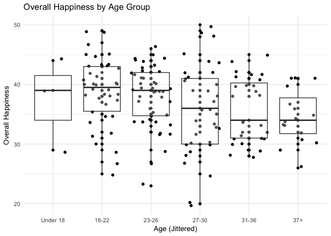

# Women in Chicago Ultimate Data Analysis

***

Outline
=====
* About:
    + Survey distributed by Steph Landry
* Models:
    + Ordered Logistic/Probit Regressions for ordered categorical variables
    + OLS regression for summed categorical variables
* Plots:
    + Many

***

 

***

   

## Munge

* Break teams into 
+ a variable `team_type` with three levels: mixed, no_club, and womens
+ a variable `club_or_not` with two levels: club and not_club

* When the outcome variable is an ordered factor (e.g., "How satisfied are you with the AMOUNT of ultimate you are currently playing?")
+ Run an ordered probit regressions with some number of predictor variables
predicting that single outcome variable

* Combine categorical variables into omnibus variables  

  + These omnibus variables are more continuous so treat them as 
  + Caveat: while directionality is constant across different variables (i.e., 1 always = bad, disagree), there are different levels for different variables that aren't necessarily comparable. They're ordered in
a way that makes the most sense, I think, but you could definitely argue for a different ordering. For example, for the question "How satisfied are you with the AMOUNT of ultimate you are currently playing?", is this the right ordering? 

"Not satisfied: wants more" < "Not satisfied: wants less" < "Neutral" < "Other" < "Somewhat satisfied: wants more" < "Somewhat satisfied: wants less" < "Very satisfied"      

¯\_(ツ)_/¯

          

## Chart

<!-- -->
