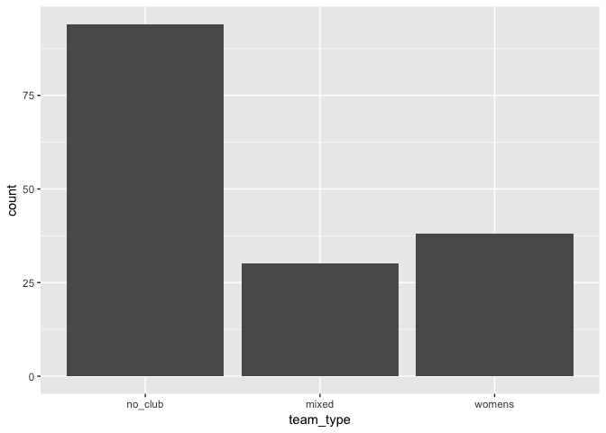
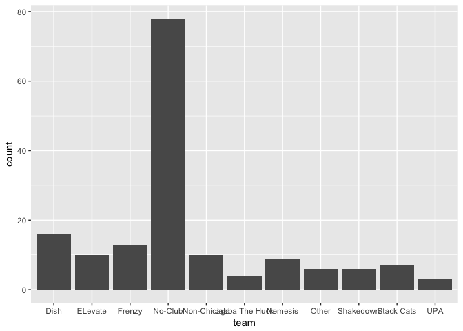
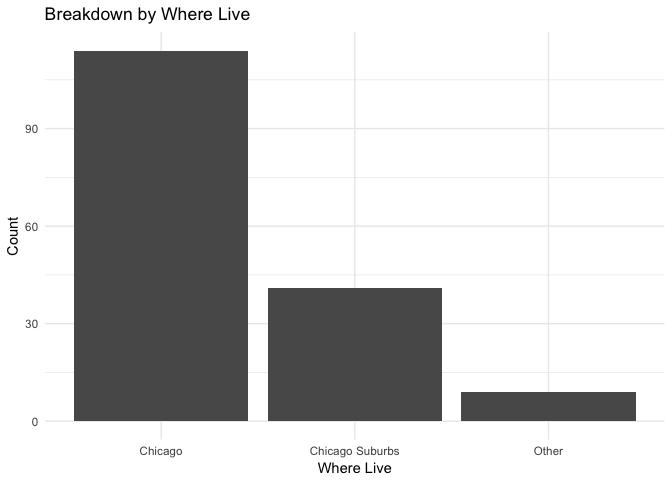
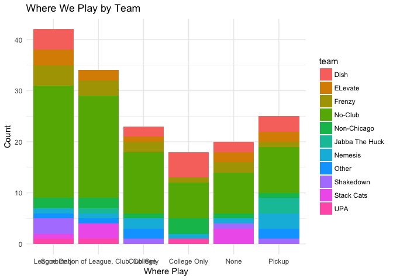
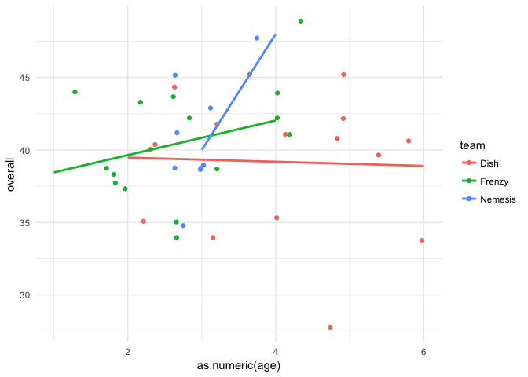
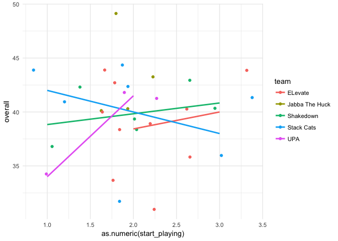
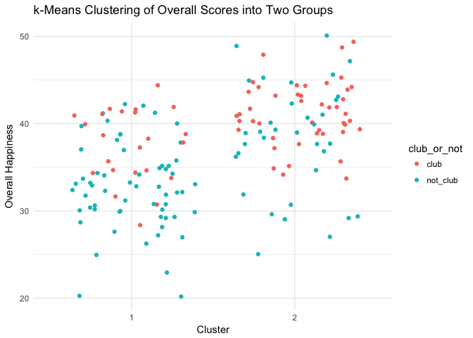
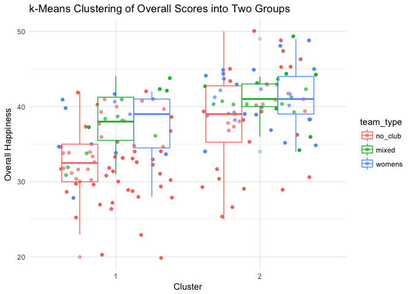

# Women in Chicago Ultimate Data Analysis
Winter 2017  

***

Outline
=====
* Munge
    + When possible, data was pulled straight from the raw data files and assigned codes in R. When not possible, data was pulled from hand-coded data source
    + Predictor variable from raw: `age`, `where_live`, `team`, `currently_playing`, `how_long_play`, `start_playing`, `first_experience`
    + Predictor variables derived: `team_type` (derived from team), `club_or_not` (derived from team type)
    + Response variables: `satis_amount_recode`, `satis_level_recode`, `conn_club`, `conn_recreational`, `conn_college`, `conn_youth`, `inclus_UC`, `inclus_college`, `inclus_women`, `inclus_mixed` 
    + Response variables derived: `satis_combined` (sum of satisfaction), `conn_combined` (sum of connectedness), `inclus_combined` (sum of inclusiveness), `overall` (sum of sums)
* Plot
    + Focused on showing the effect of `team_type` outcome variables as it was the best predictor of all the independent variables
    + A limitation of our data is that we only collected non-continuous data in both predictor and response variables. For that reason, all of the point plots are "jittered" (random noise introduced) so that they're a bit more visually interpretable. 
* Model
    + Ordered Logistic/Probit Regressions for ordered categorical response variables
    + OLS regression for summed categorical response variables
    + Only looking at main effects for now, no interations
* Main takeaway
    + `team_type` was a significant predictor of general happiness with ultimate in Chicago. Nothing else was really significant.
    + Directionality: Non-club players feel less satisfied, connected, and included than club players
    + There isn't a significant difference between how happy/satisfied women's players and mixed players feel


***

 

***

<br /><br /><br />

***

## Munge


* Categorize teams into 
    + a variable `team_type` with three levels: `mixed`, `no_club`, and `womens`. All players not on a womens or mixed team are `no_club` (which is a little misleading because this encompasses non-Chicago club teams)
    + a variable `club_or_not` with two levels: `club` and `not_club`

* When the outcome variable is an ordered factor (e.g., "How satisfied are you with the AMOUNT of ultimate you are currently playing?")
    + Run an ordered probit regression with some number of predictor variables
predicting that single outcome variable

* Combine ordered categorical predictor variables into omnibus variables and treat them as continuous
    + The idea with summing ordinal response variables was to introduce more degrees of freedom into the outcome variable so that we could run a more standard linear regression rather than an ordered/logistic probit regression on each outcome variable. It hopefully gives us both more predictive power and a more holistic look at three main categories of response variable (satisfaction, connectedness, and inclusiveness)

Caveat: while directionality is constant across different variables (i.e., 1 always = bad or disagree or whatever), there are different levels for different variables that aren't necessarily comparable. They're ordered in
a way that makes the most sense, I think, but you could definitely argue for a different ordering. 

For example, for the question "How satisfied are you with the AMOUNT of ultimate you are currently playing?", is this the right ordering? 

Not satisfied: wants more < Not satisfied: wants less < Neutral < Other < Somewhat satisfied: wants more < Somewhat satisfied: wants less < Very satisfied      

`¯\_(ツ)_/¯`

Something to try here might be to take out all the Others and relevel. Or combine things like "Not satisfied: wants more" and "Not satisfied: wants less" into the same level.

<br /><br /><br />


***
## Summary Stats


Team Type    Number of Respondents
----------  ----------------------
no_club                         94
mixed                           30
womens                          40

<br /><br /><br />

      
***
## Some Charts

What people are playing by their team 

* Note that many people took the survey after their seasons had ended so what they play in season might != what they said they were `currently_playing`

<!-- -->

<br>

Satisfaction with amount playing faceted by team type
<!-- -->


<br>

Jittered `age` (ordinal) vs. overall happiness w/ boxplot of `overall` superimposed
<!-- -->


<br><br>

#### Drilling down into team_type

Non-Club: How long have non-Chicago club players been playing?
<!-- -->

Womens: age predicting overall happiness

(Best fit lines are fitted using the linear `method = "lm"`)

<!-- -->

<br>

Mixed: where you started playing predicting overall satisfaction
<!-- -->


<br><br>

#### Satisfaction Amount by Team Type
* Focusing on amount rather than level because the model showed `team_type` predicting satisfaction amount but not level. 
* (In other words, what kind of team you're on has an effect on whether you're satisfied with the amount you're playing or not.)

<!-- -->

<!-- -->

<!-- -->

<br /><br /><br />

***
## Cluster Analyses


### K-Means clustering

Dependent variable here is `overall` happiness.

Hypothesis: 

* Unsupervised clustering into two groups --> fault line will be the `club` vs. `no_club` divide. 
* Into three groups --> clusters will mainly represent the three `team_type`s

Setup:

* Pare down the data to only the outcome variable, `overall`, and the predictor variables `age`, `where_live`, `currently_playing`, `how_long_play`, `start_playing`, and `first_experience`. So we take out `team`, `team_type`, and `club_or_not` because these are implicated in the hypothesis
* Set a kmeans algorithm on the new data  
  + Tell the algorithm we want it to cluster the data into two clusters based on the outcome variable
  + Glue this output (a series of 1 and 2s depending on which cluster each row was assigned to) along with the team varibles we took out all back together
* Data is jittered for interpretability
  


Colored by two clusters.

<!-- -->


Colored by three clusters.

<!-- -->

A plot of how `team_type` falls into the two clusters. 
<!-- -->


The same with boxplots overlaid

<!-- -->


A plot of how `club_or_not` falls into the three clusters.

<!-- -->

With team as the grouper

<!-- -->


<br /><br />

### Hierarchical Clustering

* Dependent vars: satisfaction amount and satisfaction level
* Grouping vars: `team`, `team_type`, or `where_live`
* Distance = Euclidian
* Method = centroid


Plot the heirarchy
<!-- -->


<br>

Optimal number of clusters? Depends on many factors, but somewhere around 3 or 4, usually.


<br /><br /><br />

***
## Models

Omnibus model with all predictors predicting the overall measure. (Not including `team` here because it is binned by `team_type`)


```
## 
## Call:
## lm(formula = overall ~ age + team_type + currently_playing + 
##     how_long_play + start_playing + where_live, data = all)
## 
## Residuals:
##      Min       1Q   Median       3Q      Max 
## -13.0696  -3.4739   0.0624   3.7653  14.0166 
## 
## Coefficients:
##                           Estimate Std. Error t value Pr(>|t|)    
## (Intercept)               34.61750    0.85456  40.509  < 2e-16 ***
## age.L                     -1.75042    2.58104  -0.678  0.49877    
## age.Q                     -0.41646    2.07283  -0.201  0.84106    
## age.C                      1.44790    1.56145   0.927  0.35537    
## age^4                     -1.76620    1.14665  -1.540  0.12573    
## age^5                      0.52154    0.97129   0.537  0.59215    
## team_typemixed             5.37783    1.19311   4.507 1.37e-05 ***
## team_typewomens            5.25785    1.08403   4.850 3.22e-06 ***
## currently_playing.L        0.97023    1.04499   0.928  0.35476    
## currently_playing.Q       -0.19137    1.12741  -0.170  0.86546    
## currently_playing.C       -0.21041    1.13126  -0.186  0.85271    
## currently_playing^4       -0.12662    1.14346  -0.111  0.91199    
## currently_playing^5       -1.96963    1.18942  -1.656  0.09996 .  
## how_long_play.L            1.13073    1.74601   0.648  0.51829    
## how_long_play.Q           -0.60788    1.35292  -0.449  0.65390    
## how_long_play.C            0.65231    1.14202   0.571  0.56878    
## how_long_play^4           -2.71851    0.96685  -2.812  0.00563 ** 
## start_playing.L           -0.61066    0.99277  -0.615  0.53948    
## start_playing.Q            0.04398    0.74445   0.059  0.95298    
## where_liveChicago Suburbs -0.84417    1.02970  -0.820  0.41370    
## where_liveOther           -2.79567    2.08464  -1.341  0.18205    
## ---
## Signif. codes:  0 '***' 0.001 '**' 0.01 '*' 0.05 '.' 0.1 ' ' 1
## 
## Residual standard error: 5.297 on 141 degrees of freedom
##   (2 observations deleted due to missingness)
## Multiple R-squared:  0.3075,	Adjusted R-squared:  0.2092 
## F-statistic:  3.13 on 20 and 141 DF,  p-value: 4.15e-05
```

* So `team_type` is really the only good predictor

<br>

Drilling down into `team`, what's driving the dissatisfaction among `no_club` players?

* People who don't play any club at all (p = 0.00112)

```
## 
## Call:
## lm(formula = overall ~ team, data = all)
## 
## Residuals:
##     Min      1Q  Median      3Q     Max 
## -14.269  -3.733   0.050   3.483  14.731 
## 
## Coefficients:
##                    Estimate Std. Error t value Pr(>|t|)    
## (Intercept)         39.1875     1.3490  29.049  < 2e-16 ***
## teamELevate         -0.2875     2.1752  -0.132  0.89502    
## teamFrenzy           1.4125     1.9393   0.728  0.46751    
## teamNo-Club         -4.9183     1.4809  -3.321  0.00112 ** 
## teamNon-Chicago     -1.4875     2.1752  -0.684  0.49511    
## teamJabba The Huck   3.8125     3.0165   1.264  0.20819    
## teamNemesis          1.7014     2.2484   0.757  0.45038    
## teamOther           -4.3542     2.5832  -1.686  0.09391 .  
## teamShakedown        0.6458     2.5832   0.250  0.80291    
## teamStack Cats       0.8125     2.4453   0.332  0.74014    
## teamUPA             -0.1875     3.3949  -0.055  0.95603    
## ---
## Signif. codes:  0 '***' 0.001 '**' 0.01 '*' 0.05 '.' 0.1 ' ' 1
## 
## Residual standard error: 5.396 on 153 degrees of freedom
## Multiple R-squared:  0.2292,	Adjusted R-squared:  0.1788 
## F-statistic: 4.549 on 10 and 153 DF,  p-value: 1.204e-05
```

<br><br>

* All other models with a single predictor variable predicting `overall` were not significant.

<br><br>

#### Satisfaction Measures

What about the effect of team type on satisfaction of just the **level** of ultimate you're playing?  

* Make two models, one with `team_type` as a predictor and one without


<br> 

* Compare the performance of the models in predicting satisfaction level
* The model with team type does't predict satisfaction level better than the one without it (p = 0.6361). 
* So team_type is not a significant predictor of satisfaciton with the level of ultimate you're playing.

```
## Likelihood ratio tests of cumulative link models:
##  
##                         formula:                             link: 
## m.satis_level_no.team_t satis_level_recode ~ age             probit
## m.satis_level_team_t    satis_level_recode ~ team_type + age probit
##                         threshold:
## m.satis_level_no.team_t flexible  
## m.satis_level_team_t    flexible  
## 
##                         no.par    AIC  logLik LR.stat df Pr(>Chisq)
## m.satis_level_no.team_t      9 401.10 -191.55                      
## m.satis_level_team_t        11 404.19 -191.10  0.9048  2     0.6361
```

<br> 

What about satisfaction with the **amount** of ultimate you're playing?

* Same procedure


<br>

Model with team type *does* predict satisfaction level better than the one without it (p = 0.0072)

```
## Likelihood ratio tests of cumulative link models:
##  
##                         formula:                              link: 
## m.sais_amount_no.team_t satis_amount_recode ~ age             probit
## m.sais_amount_team_t    satis_amount_recode ~ team_type + age probit
##                         threshold:
## m.sais_amount_no.team_t flexible  
## m.sais_amount_team_t    flexible  
## 
##                         no.par    AIC  logLik LR.stat df Pr(>Chisq)   
## m.sais_amount_no.team_t     10 480.57 -230.29                         
## m.sais_amount_team_t        12 474.71 -225.35  9.8677  2   0.007199 **
## ---
## Signif. codes:  0 '***' 0.001 '**' 0.01 '*' 0.05 '.' 0.1 ' ' 1
```

<br>

Okay so there's a there there with `team_type`. So does `team_type` pedict overall satisfaction, inclusion, connection, and all of the above?

<br>
**Do womens and mixed players have significantly higher overall satisfaction, connectedness, and inclusion than non-club players?**

Satisfaction: yes (p = 0.0252)

```
## 
## Call:
## lm(formula = satis_combined ~ team_type, data = all)
## 
## Residuals:
##     Min      1Q  Median      3Q     Max 
## -8.4333 -1.4333  0.5667  1.8830  3.8830 
## 
## Coefficients:
##                 Estimate Std. Error t value Pr(>|t|)    
## (Intercept)      10.1170     0.2679  37.766   <2e-16 ***
## team_typemixed    1.3163     0.5446   2.417   0.0168 *  
## team_typewomens   1.1080     0.4903   2.260   0.0252 *  
## ---
## Signif. codes:  0 '***' 0.001 '**' 0.01 '*' 0.05 '.' 0.1 ' ' 1
## 
## Residual standard error: 2.597 on 161 degrees of freedom
## Multiple R-squared:  0.05091,	Adjusted R-squared:  0.03912 
## F-statistic: 4.318 on 2 and 161 DF,  p-value: 0.0149
```

Connection: yes (p = 1.17e-07)

```
## 
## Call:
## lm(formula = conn_combined ~ team_type, data = all)
## 
## Residuals:
##     Min      1Q  Median      3Q     Max 
## -7.1750 -2.1898 -0.2045  1.8250  7.7660 
## 
## Coefficients:
##                 Estimate Std. Error t value Pr(>|t|)    
## (Intercept)       9.2340     0.2897  31.875  < 2e-16 ***
## team_typemixed    1.8993     0.5890   3.225  0.00153 ** 
## team_typewomens   2.9410     0.5302   5.547 1.17e-07 ***
## ---
## Signif. codes:  0 '***' 0.001 '**' 0.01 '*' 0.05 '.' 0.1 ' ' 1
## 
## Residual standard error: 2.809 on 161 degrees of freedom
## Multiple R-squared:  0.1744,	Adjusted R-squared:  0.1641 
## F-statistic:    17 on 2 and 161 DF,  p-value: 1.998e-07
```

Inclusion: yes (p = 0.00245)

```
## 
## Call:
## lm(formula = inclus_combined ~ team_type, data = all)
## 
## Residuals:
##     Min      1Q  Median      3Q     Max 
## -6.7000 -1.4250 -0.3191  1.6809  4.6809 
## 
## Coefficients:
##                 Estimate Std. Error t value Pr(>|t|)    
## (Intercept)      15.3191     0.2451  62.490  < 2e-16 ***
## team_typemixed    2.0142     0.4984   4.041 8.21e-05 ***
## team_typewomens   1.3809     0.4487   3.078  0.00245 ** 
## ---
## Signif. codes:  0 '***' 0.001 '**' 0.01 '*' 0.05 '.' 0.1 ' ' 1
## 
## Residual standard error: 2.377 on 161 degrees of freedom
## Multiple R-squared:  0.1135,	Adjusted R-squared:  0.1025 
## F-statistic:  10.3 on 2 and 161 DF,  p-value: 6.156e-05
```

Overall: yes (p = 2.82e-07)

```
## 
## Call:
## lm(formula = overall ~ team_type, data = all)
## 
## Residuals:
##     Min      1Q  Median      3Q     Max 
## -14.670  -3.670   0.100   3.472  15.330 
## 
## Coefficients:
##                 Estimate Std. Error t value Pr(>|t|)    
## (Intercept)      34.6702     0.5533  62.661  < 2e-16 ***
## team_typemixed    5.2298     1.1249   4.649 6.90e-06 ***
## team_typewomens   5.4298     1.0127   5.362 2.82e-07 ***
## ---
## Signif. codes:  0 '***' 0.001 '**' 0.01 '*' 0.05 '.' 0.1 ' ' 1
## 
## Residual standard error: 5.364 on 161 degrees of freedom
## Multiple R-squared:  0.1984,	Adjusted R-squared:  0.1884 
## F-statistic: 19.92 on 2 and 161 DF,  p-value: 1.861e-08
```

<br>

Is there a significant difference in combined satisfaction and inclusion scores between womens and mixed players?
No, p = 0.841


```
## 
## Call:
## lm(formula = overall ~ team_type, data = all[all$team_type %in% 
##     c("womens", "mixed"), ])
## 
## Residuals:
##    Min     1Q Median     3Q    Max 
## -12.10  -2.05   0.10   2.90   9.10 
## 
## Coefficients:
##                 Estimate Std. Error t value Pr(>|t|)    
## (Intercept)      39.9000     0.7516  53.089   <2e-16 ***
## team_typewomens   0.2000     0.9942   0.201    0.841    
## ---
## Signif. codes:  0 '***' 0.001 '**' 0.01 '*' 0.05 '.' 0.1 ' ' 1
## 
## Residual standard error: 4.117 on 68 degrees of freedom
## Multiple R-squared:  0.0005947,	Adjusted R-squared:  -0.0141 
## F-statistic: 0.04047 on 1 and 68 DF,  p-value: 0.8412
```

<br>

So, narrowing down to club or not, is playing club at all a significant predictor of overall happiness with ultimate in Chicago?

<!-- -->

<br>

Yes, p = 2.32e-09

```
## 
## Call:
## lm(formula = overall ~ club_or_not, data = all)
## 
## Residuals:
##      Min       1Q   Median       3Q      Max 
## -14.6702  -3.6702  -0.0143   3.4938  15.3298 
## 
## Coefficients:
##                     Estimate Std. Error t value Pr(>|t|)    
## (Intercept)          40.0143     0.6392  62.597  < 2e-16 ***
## club_or_notnot_club  -5.3441     0.8443  -6.329 2.32e-09 ***
## ---
## Signif. codes:  0 '***' 0.001 '**' 0.01 '*' 0.05 '.' 0.1 ' ' 1
## 
## Residual standard error: 5.348 on 162 degrees of freedom
## Multiple R-squared:  0.1983,	Adjusted R-squared:  0.1933 
## F-statistic: 40.06 on 1 and 162 DF,  p-value: 2.315e-09
```


<br><br><br>


 

<br><br><br>


#### Future directions
* Merge with overall stats of where people are playing
* Merge with qualitative dat
* Check goodness of fit of models


<br><br><br>


