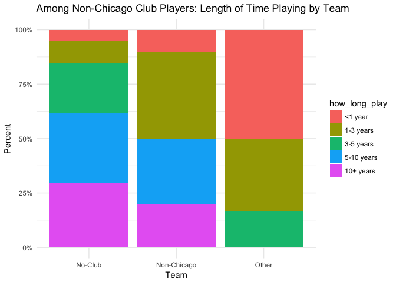
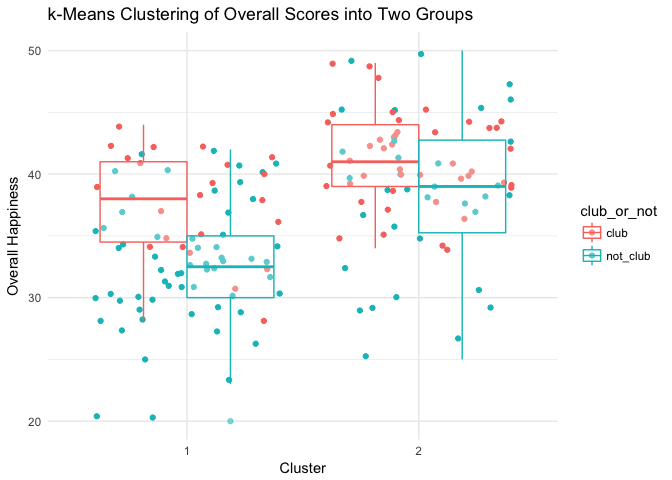
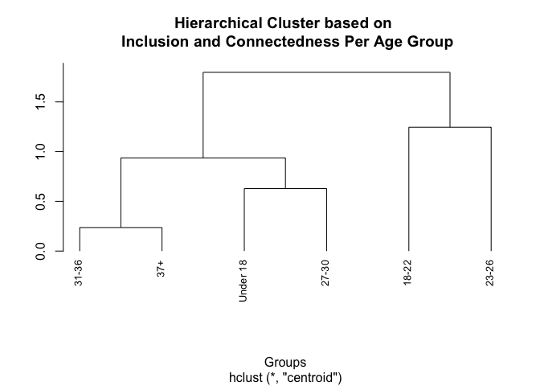
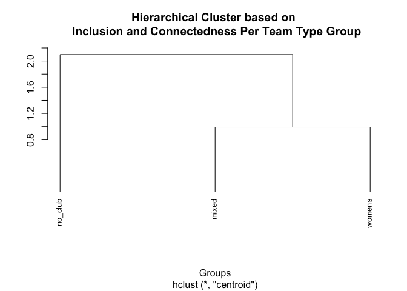

# Women in Chicago Ultimate Data Analysis
Winter 2017  

***

Outline
=====
* Munge
    + When possible, data was pulled straight from the raw data files and assigned codes in R. When not possible, data was pulled from hand-coded data source
    + Predictor variable from raw: `age`, `where_live`, `team`, `currently_playing`, `how_long_play`, `start_playing`, `first_experience`
    + Predictor variables derived: `team_type` (derived from team), `club_or_not` (derived from team type)
    + Response variables: `satis_amount_recode`, `satis_level_recode`, `conn_club`, `conn_recreational`, `conn_college`, `conn_youth`, `inclus_UC`, `inclus_college`, `inclus_women`, `inclus_mixed` 
    + Response variables derived: `satis_combined` (sum of satisfaction), `conn_combined` (sum of connectedness), `inclus_combined` (sum of inclusiveness), `overall` (sum of sums)
* Plot
    + Focused on showing the effect of `team_type` outcome variables as it was the best predictor of all the independent variables
    + A limitation of our data is that we only collected non-continuous data in both predictor and response variables. For that reason, all of the point plots are "jittered" (random noise introduced) so that they're a bit more visually interpretable. 
* Model
    + Ordered Logistic/Probit Regressions for ordered categorical response variables
    + OLS regression for summed categorical response variables
    + Only looking at main effects for now, no interations
* Main takeaway
    + `team_type` was a significant predictor of general happiness with ultimate in Chicago. Nothing else was really significant.
    + Directionality: Non-club players feel less satisfied, connected, and included than club players
    + There isn't a significant difference between how happy/satisfied women's players and mixed players feel


***

 

***

<br /><br /><br />

***

## Munge


* Variables collected on a Lickert scale were treated ordinally. Otherwise, treated categorically.

* Categorize teams into 
    + a variable `team_type` with three levels: `mixed`, `no_club`, and `womens`. All players not on a womens or mixed team are `no_club` (which is a little misleading because this encompasses non-Chicago club teams)
    + a variable `club_or_not` with two levels: `club` and `not_club`

* When the outcome variable is an ordered factor (e.g., "How satisfied are you with the AMOUNT of ultimate you are currently playing?")
    + Run an ordered probit regression with some number of predictor variables
predicting that single outcome variable

* Combine ordered categorical predictor variables into omnibus variables and treat them as continuous
    + The idea with summing ordinal response variables was to introduce more degrees of freedom into the outcome variable so that we could run a more standard linear regression rather than an ordered/logistic probit regression on each outcome variable. It hopefully gives us both more predictive power and a more holistic look at three main categories of response variable (satisfaction, connectedness, and inclusiveness)
    + These are: `satis_combined`, `conn_combined`, `inclus_combined`, and their sum, `overall`

Caveat: while directionality is constant across different variables (i.e., 1 always = bad or disagree or whatever), there are different levels for different variables that aren't necessarily comparable. They're ordered in
a way that makes the most sense, I think, but you could definitely argue for a different ordering. 

For example, for the question "How satisfied are you with the AMOUNT of ultimate you are currently playing?", is this the right ordering? 

Not satisfied: wants more < Not satisfied: wants less < Neutral < Other < Somewhat satisfied: wants more < Somewhat satisfied: wants less < Very satisfied      

`¯\_(ツ)_/¯`

Something to try here might be to take out all the Others and relevel. Or combine things like "Not satisfied: wants more" and "Not satisfied: wants less" into the same level.

<br /><br /><br />


***
## Summary Stats

<br>
Snapshot of the top of the data:


|Particiapnt: |Age:  |Please choose the option that best describes where you currently live. |May we anonymously quote your answers from this survey?            |Do you currently play or practice with a Chicago-based club team? |Please indicate the ultimate you are playing (or registered for) right now: |How long have you been playing ultimate? |At what point in your life did you start playing ultimate? |What best describes your first ultimate experience?   |How satisfied are you with the AMOUNT of ultimate you are currently playing?                                 |How satisfied are you with the LEVEL of ultimate you are currently playing?                                                   |How connected do you feel to the CLUB ultimate community in Chicago? |How connected do you feel to the RECREATIONAL ultimate community in Chicago? (e.g. UC leagues, pickup) |How connected do you feel to the COLLEGE ultimate community in Chicago? |How connected do you feel to the YOUTH ultimate community in Chicago? (e.g. CUJO, YCC, high school, middle school, etc.) |Ultimate Chicago supports the development and inclusion of women in ultimate. |College ultimate teams support the development and inclusion of women in ultimate. |Women's club teams support the development and inclusion of women in ultimate. |Mixed club teams support the development and inclusion of women in ultimate. |
|:------------|:-----|:----------------------------------------------------------------------|:------------------------------------------------------------------|:-----------------------------------------------------------------|:---------------------------------------------------------------------------|:----------------------------------------|:----------------------------------------------------------|:-----------------------------------------------------|:------------------------------------------------------------------------------------------------------------|:-----------------------------------------------------------------------------------------------------------------------------|:--------------------------------------------------------------------|:------------------------------------------------------------------------------------------------------|:-----------------------------------------------------------------------|:------------------------------------------------------------------------------------------------------------------------|:-----------------------------------------------------------------------------|:----------------------------------------------------------------------------------|:------------------------------------------------------------------------------|:----------------------------------------------------------------------------|
|A            |18-22 |I live in Chicago.                                                     |Yes, you may anonymously quote my answers to further this project. |Frenzy                                                            |Women's Club, College women's                                               |<1 year                                  |College                                                    |College women's team                                  |Somewhat satisfied -- I sometimes wish I could play more, but overall I'm happy with the amount that I play. |Somewhat satisfied -- I sometimes wish I could play more competitively, but overall I'm satisfied with the level that I play. |Somewhat connected                                                   |Neutral                                                                                                |Somewhat connected                                                      |Disconnected                                                                                                             |Neutral - I don't have an opinion here.                                       |Agree                                                                              |Agree                                                                          |Somewhat disagree                                                            |
|B            |37+   |I live in a Chicago suburb.                                            |Yes, you may anonymously quote my answers to further this project. |UPA                                                               |Mixed Club                                                                  |10+ years                                |Post-college                                               |Recreational league (e.g. an Ultimate Chicago league) |Very satisfied -- I'm playing just the right amount                                                          |Very satisfied -- I have the opportunity to play at the right level of competitiveness for me.                                |Somewhat connected                                                   |Somewhat disconnected                                                                                  |Disconnected                                                            |Somewhat connected                                                                                                       |Agree                                                                         |Neutral - I don't have an opinion here.                                            |Agree                                                                          |Neutral - I don't have an opinion                                            |
|C            |31-36 |I live in Chicago.                                                     |Yes, you may anonymously quote my answers to further this project. |I don't play on a Chicago-based club team.                        |UC Fall League (Mixed)                                                      |5-10 years                               |Post-college                                               |Recreational league (e.g. an Ultimate Chicago league) |Neutral -- I don't have strong feelings about the amount of ultimate I'm playing.                            |Somewhat satisfied -- I sometimes wish I could play more competitively, but overall I'm satisfied with the level that I play. |Disconnected                                                         |Somewhat connected                                                                                     |Disconnected                                                            |Disconnected                                                                                                             |Somewhat Agree                                                                |Neutral - I don't have an opinion here.                                            |Neutral - I don't have an opinion here.                                        |Neutral - I don't have an opinion                                            |

<br>

*What were the variables considered?*

**Predictor variables**

|Variable          |Name                                                                        |
|:-----------------|:---------------------------------------------------------------------------|
|age               |Age:                                                                        |
|can_quote         |Please choose the option that best describes where you currently live.      |
|where_live        |May we anonymously quote your answers from this survey?                     |
|team              |Do you currently play or practice with a Chicago-based club team?           |
|currently_playing |Please indicate the ultimate you are playing (or registered for) right now: |
|how_long_play     |How long have you been playing ultimate?                                    |
|start_playing     |At what point in your life did you start playing ultimate?                  |
|first_experience  |What best describes your first ultimate experience?                         |

<br>

**Outcome variables**

|Variable            |Name                                                                                                                     |
|:-------------------|:------------------------------------------------------------------------------------------------------------------------|
|satis_amount_recode |How satisfied are you with the AMOUNT of ultimate you are currently playing?                                             |
|satis_level_recode  |How satisfied are you with the LEVEL of ultimate you are currently playing?                                              |
|conn_club           |How connected do you feel to the CLUB ultimate community in Chicago?                                                     |
|conn_recreational   |How connected do you feel to the RECREATIONAL ultimate community in Chicago? (e.g. UC leagues, pickup)                   |
|conn_college        |How connected do you feel to the COLLEGE ultimate community in Chicago?                                                  |
|conn_youth          |How connected do you feel to the YOUTH ultimate community in Chicago? (e.g. CUJO, YCC, high school, middle school, etc.) |
|inclus_UC           |Ultimate Chicago supports the development and inclusion of women in ultimate.                                            |
|inclus_college      |College ultimate teams support the development and inclusion of women in ultimate.                                       |
|inclus_women        |Women's club teams support the development and inclusion of women in ultimate.                                           |
|inclus_mixed        |Mixed club teams support the development and inclusion of women in ultimate.                                             |

<br>

*Outcome variable summary*

* Means by team of the omnibus variables `satis_combined`, `conn_combined`, `inclus_combined`, ordered by their sum, `overall`
* For a sneak peek of the main finding, check that team type column


|Team Type |Team           | Satisfaction| Connectedness| Inclusion| Overall|
|:---------|:--------------|------------:|-------------:|---------:|-------:|
|No Club   |No-Club        |         9.91|          9.05|     15.34|   34.30|
|No Club   |Other          |        11.00|         10.00|     13.83|   34.83|
|No Club   |Non-Chicago    |        11.10|         10.40|     16.20|   37.70|
|Mixed     |ELevate        |        11.00|         10.60|     17.30|   38.90|
|Mixed     |UPA            |        13.33|         10.67|     15.00|   39.00|
|Womens    |Dish           |        10.75|         12.31|     16.12|   39.19|
|Mixed     |Shakedown      |        11.67|         10.00|     18.17|   39.83|
|Mixed     |Stack Cats     |        10.86|         11.71|     17.43|   40.00|
|Womens    |Frenzy         |        11.40|         12.00|     17.20|   40.60|
|Womens    |Nemesis        |        11.78|         12.22|     16.89|   40.89|
|Mixed     |Jabba The Huck |        11.75|         13.50|     17.75|   43.00|


<br /><br /><br />

      
***
## Some Charts

Have some histograms of some predictor variables:


<!-- --><!-- --><!-- --><!-- --><!-- -->

 


<br><br><br>

***

## A smattering of other charts
* These are just examples of the types of graphs we could make, depending on what people are interested in looking at -- they're not necessarily particularly meaningful in and of themselves

<br><br>

**What people are playing by their team** 

* Note that many people took the survey after their seasons had ended so what they play in season might != what they said they were `currently_playing`

<!-- -->


<br>

**Jittered `age` (ordinal) vs. overall happiness w/ boxplot of `overall` superimposed**
<!-- -->


<br><br>

### Drilling down into team_type

**Non-Club: How long have non-Chicago club players been playing?**
<!-- -->

<br>

**Womens: age predicting overall happiness**

(Best fit lines are fitted using the linear `method = "lm"`)

<!-- -->

<br>

**Mixed: where you started playing predicting overall satisfaction**
<!-- -->

<br><br>

***
## Cluster Analyses

Can we suss out some clusters with k-means (less greedy) or heirarhical clustering (more greedy)?

<br>

### K-Means clustering

* Dependent variable here is `overall` happiness.

Hypothesis: 

* Unsupervised clustering into two groups --> fault line will be the `club` vs. `no_club` divide. 
* Into three groups --> clusters will mainly represent the three `team_type`s

Setup:

* Pare down the data to only the outcome variable, `overall`, and the predictor variables `age`, `where_live`, `currently_playing`, `how_long_play`, `start_playing`, and `first_experience`. So we take out `team`, `team_type`, and `club_or_not` because these are implicated in the hypothesis
* Set a kmeans algorithm on the new data  
  + Tell the algorithm we want it to cluster the data into two clusters based on the outcome variable
  + Glue this output (a series of 1 and 2s depending on which cluster each row was assigned to) along with the team varibles we took out all back together
* Data is jittered for interpretability
  

<br>


<br>

Individuals broken into two clusters (x axis). Their team type is shown by the color of their dot. 

<!-- -->


The same with box plots of overall happiness by team type are overlaid. 

<!-- -->

<br>

Colored by team type rather than club or not. 

<!-- -->

<br> 

Three clusters doesn't give us much more information.

<!-- -->


<br>


<br /><br />

### Hierarchical Clustering

* Dependent vars: inclusion and connectedness
* Grouping var: `age`


<!-- -->

<br><br><br>

These age clusters seem to make pretty good sense. Try a similar clustering strategy based on team.

* Dependent vars: satisfaction amount and satisfaction level
* Grouping var: `team`

<!-- -->


<br /><br /><br />
<br /><br />


***
## Models
<br />

Omnibus model with all predictors predicting the overall measure. (Not including `team` here because it is binned by `team_type`)

* Throw all the predictors in and see what comes out significant


```
## 
## Call:
## lm(formula = overall ~ age + team_type + currently_playing + 
##     how_long_play + start_playing + where_live, data = all)
## 
## Residuals:
##     Min      1Q  Median      3Q     Max 
## -13.102  -3.435   0.191   3.820  13.978 
## 
## Coefficients:
##                                                       Estimate Std. Error
## (Intercept)                                           32.89719    4.01058
## age18-22                                               2.68338    3.37460
## age23-26                                              -0.07182    3.48251
## age27-30                                              -0.63664    3.53739
## age31-36                                              -0.39929    3.63249
## age37+                                                -0.89453    3.89810
## team_typemixed                                         5.37088    1.19700
## team_typewomens                                        5.24275    1.08828
## currently_playingCombination of League, Club, College -0.46893    1.30193
## currently_playingClub Only                             1.70559    1.50689
## currently_playingCollege Only                         -0.51293    1.58925
## currently_playingNone                                  1.68149    1.53754
## currently_playingPickup                                0.75561    1.40265
## how_long_play1-3 years                                 3.10730    2.20874
## how_long_play3-5 years                                 0.01944    2.13407
## how_long_play5-10 years                                2.98830    2.21233
## how_long_play10+ years                                 1.84583    2.50770
## start_playingCollege                                  -0.53574    1.15177
## start_playingPost-College                             -0.90846    1.41420
## where_liveChicago Suburbs                             -0.86606    1.03481
## where_liveOther                                       -2.84025    2.09504
##                                                       t value Pr(>|t|)    
## (Intercept)                                             8.203 1.37e-13 ***
## age18-22                                                0.795    0.428    
## age23-26                                               -0.021    0.984    
## age27-30                                               -0.180    0.857    
## age31-36                                               -0.110    0.913    
## age37+                                                 -0.229    0.819    
## team_typemixed                                          4.487 1.49e-05 ***
## team_typewomens                                         4.817 3.73e-06 ***
## currently_playingCombination of League, Club, College  -0.360    0.719    
## currently_playingClub Only                              1.132    0.260    
## currently_playingCollege Only                          -0.323    0.747    
## currently_playingNone                                   1.094    0.276    
## currently_playingPickup                                 0.539    0.591    
## how_long_play1-3 years                                  1.407    0.162    
## how_long_play3-5 years                                  0.009    0.993    
## how_long_play5-10 years                                 1.351    0.179    
## how_long_play10+ years                                  0.736    0.463    
## start_playingCollege                                   -0.465    0.643    
## start_playingPost-College                              -0.642    0.522    
## where_liveChicago Suburbs                              -0.837    0.404    
## where_liveOther                                        -1.356    0.177    
## ---
## Signif. codes:  0 '***' 0.001 '**' 0.01 '*' 0.05 '.' 0.1 ' ' 1
## 
## Residual standard error: 5.314 on 140 degrees of freedom
##   (2 observations deleted due to missingness)
## Multiple R-squared:  0.3052,	Adjusted R-squared:  0.2059 
## F-statistic: 3.074 on 20 and 140 DF,  p-value: 5.578e-05
```

* So `team_type` is really the only good predictor
* Stepwise and all subsets regression analyses confirms this (not shown here yet)

<br>
Are there patterns in how the happiness scores of players in each team type cluster?


* Yes: when we cluster by team type, we get the same answer, even when outcome variables are not combined into an overall score: womens and mixed team players are closer to each other on measures of happiness than they are to non-club players

<!-- --><!-- -->


<br><br>

Drilling down into `team`, what's driving the dissatisfaction among `no_club` players?

* People who don't play any club at all (p = 0.00112)

```
## 
## Call:
## lm(formula = overall ~ team, data = all)
## 
## Residuals:
##     Min      1Q  Median      3Q     Max 
## -14.299  -3.767   0.100   3.551  14.701 
## 
## Coefficients:
##                    Estimate Std. Error t value Pr(>|t|)    
## (Intercept)         39.1875     1.3526  28.971  < 2e-16 ***
## teamELevate         -0.2875     2.1811  -0.132  0.89530    
## teamFrenzy           1.4125     1.9446   0.726  0.46872    
## teamNo-Club         -4.8888     1.4866  -3.289  0.00125 ** 
## teamNon-Chicago     -1.4875     2.1811  -0.682  0.49628    
## teamJabba The Huck   3.8125     3.0246   1.260  0.20942    
## teamNemesis          1.7014     2.2544   0.755  0.45160    
## teamOther           -4.3542     2.5901  -1.681  0.09480 .  
## teamShakedown        0.6458     2.5901   0.249  0.80343    
## teamStack Cats       0.8125     2.4519   0.331  0.74082    
## teamUPA             -0.1875     3.4041  -0.055  0.95615    
## ---
## Signif. codes:  0 '***' 0.001 '**' 0.01 '*' 0.05 '.' 0.1 ' ' 1
## 
## Residual standard error: 5.411 on 152 degrees of freedom
## Multiple R-squared:  0.2268,	Adjusted R-squared:  0.1759 
## F-statistic: 4.459 on 10 and 152 DF,  p-value: 1.629e-05
```

<br><br>

* All other models with a single predictor variable predicting `overall` were not significant.

<br><br>

#### Satisfaction Measures

What about the effect of team type on satisfaction of just the **level** of ultimate you're playing?  

* Make two models, one with `team_type` as a predictor and one without


<br> 

* Compare the performance of the models in predicting satisfaction level
* The model with team type does't predict satisfaction level better than the one without it (p = 0.6361). 
* So team_type is not a significant predictor of satisfaciton with the level of ultimate you're playing.

```
## Likelihood ratio tests of cumulative link models:
##  
##                         formula:                             link: 
## m.satis_level_no.team_t satis_level_recode ~ age             probit
## m.satis_level_team_t    satis_level_recode ~ team_type + age probit
##                         threshold:
## m.satis_level_no.team_t flexible  
## m.satis_level_team_t    flexible  
## 
##                         no.par    AIC  logLik LR.stat df Pr(>Chisq)
## m.satis_level_no.team_t      9 393.92 -187.96                      
## m.satis_level_team_t        11 397.00 -187.50  0.9163  2     0.6325
```

<br> 

What about satisfaction with the **amount** of ultimate you're playing?

* Same procedure


<br>

Model with team type *does* predict satisfaction level better than the one without it (p = 0.0072)

```
## Likelihood ratio tests of cumulative link models:
##  
##                         formula:                              link: 
## m.sais_amount_no.team_t satis_amount_recode ~ age             probit
## m.sais_amount_team_t    satis_amount_recode ~ team_type + age probit
##                         threshold:
## m.sais_amount_no.team_t flexible  
## m.sais_amount_team_t    flexible  
## 
##                         no.par    AIC  logLik LR.stat df Pr(>Chisq)   
## m.sais_amount_no.team_t     10 478.95 -229.47                         
## m.sais_amount_team_t        12 473.09 -224.55  9.8549  2   0.007245 **
## ---
## Signif. codes:  0 '***' 0.001 '**' 0.01 '*' 0.05 '.' 0.1 ' ' 1
```


<br> 
* And that difference is borne out in this graph (check that leftmost bar)
<br>

<!-- -->


<br>

Okay so there's a there there with `team_type`. So does `team_type` pedict overall satisfaction, inclusion, connection, and all of the above?

<br>

***
<br>
**Do womens and mixed players have significantly higher overall satisfaction, connectedness, and inclusion than non-club players?**

Satisfaction: yes (p = 0.0252)

```
## 
## Call:
## lm(formula = satis_combined ~ team_type, data = all)
## 
## Residuals:
##     Min      1Q  Median      3Q     Max 
## -8.4333 -1.4333  0.5667  1.8925  3.8925 
## 
## Coefficients:
##                 Estimate Std. Error t value Pr(>|t|)    
## (Intercept)      10.1075     0.2701  37.426   <2e-16 ***
## team_typemixed    1.3258     0.5468   2.424   0.0164 *  
## team_typewomens   1.1175     0.4925   2.269   0.0246 *  
## ---
## Signif. codes:  0 '***' 0.001 '**' 0.01 '*' 0.05 '.' 0.1 ' ' 1
## 
## Residual standard error: 2.604 on 160 degrees of freedom
## Multiple R-squared:  0.05148,	Adjusted R-squared:  0.03963 
## F-statistic: 4.342 on 2 and 160 DF,  p-value: 0.01458
```

Connection: yes (p = 1.17e-07)

```
## 
## Call:
## lm(formula = conn_combined ~ team_type, data = all)
## 
## Residuals:
##    Min     1Q Median     3Q    Max 
## -7.175 -2.175 -0.175  1.825  7.742 
## 
## Coefficients:
##                 Estimate Std. Error t value Pr(>|t|)    
## (Intercept)       9.2581     0.2916  31.752  < 2e-16 ***
## team_typemixed    1.8753     0.5904   3.176  0.00179 ** 
## team_typewomens   2.9169     0.5317   5.486 1.58e-07 ***
## ---
## Signif. codes:  0 '***' 0.001 '**' 0.01 '*' 0.05 '.' 0.1 ' ' 1
## 
## Residual standard error: 2.812 on 160 degrees of freedom
## Multiple R-squared:  0.1718,	Adjusted R-squared:  0.1614 
## F-statistic: 16.59 on 2 and 160 DF,  p-value: 2.832e-07
```

Inclusion: yes (p = 0.00245)

```
## 
## Call:
## lm(formula = inclus_combined ~ team_type, data = all)
## 
## Residuals:
##     Min      1Q  Median      3Q     Max 
## -6.7000 -1.5167 -0.3333  1.6667  4.6667 
## 
## Coefficients:
##                 Estimate Std. Error t value Pr(>|t|)    
## (Intercept)      15.3333     0.2470  62.081  < 2e-16 ***
## team_typemixed    2.0000     0.5001   3.999 9.69e-05 ***
## team_typewomens   1.3667     0.4504   3.035  0.00281 ** 
## ---
## Signif. codes:  0 '***' 0.001 '**' 0.01 '*' 0.05 '.' 0.1 ' ' 1
## 
## Residual standard error: 2.382 on 160 degrees of freedom
## Multiple R-squared:  0.1116,	Adjusted R-squared:  0.1005 
## F-statistic: 10.05 on 2 and 160 DF,  p-value: 7.729e-05
```

Overall: yes (p = 2.82e-07)

```
## 
## Call:
## lm(formula = overall ~ team_type, data = all)
## 
## Residuals:
##     Min      1Q  Median      3Q     Max 
## -14.699  -3.699   0.100   3.600  15.301 
## 
## Coefficients:
##                 Estimate Std. Error t value Pr(>|t|)    
## (Intercept)      34.6989     0.5576  62.233  < 2e-16 ***
## team_typemixed    5.2011     1.1290   4.607 8.30e-06 ***
## team_typewomens   5.4011     1.0167   5.312 3.57e-07 ***
## ---
## Signif. codes:  0 '***' 0.001 '**' 0.01 '*' 0.05 '.' 0.1 ' ' 1
## 
## Residual standard error: 5.377 on 160 degrees of freedom
## Multiple R-squared:  0.1962,	Adjusted R-squared:  0.1861 
## F-statistic: 19.53 on 2 and 160 DF,  p-value: 2.583e-08
```

<br>


Is there a significant difference in combined satisfaction and inclusion scores between womens and mixed players?
No, p = 0.841


```
## 
## Call:
## lm(formula = overall ~ team_type, data = all[all$team_type %in% 
##     c("womens", "mixed"), ])
## 
## Residuals:
##    Min     1Q Median     3Q    Max 
## -12.10  -2.05   0.10   2.90   9.10 
## 
## Coefficients:
##                 Estimate Std. Error t value Pr(>|t|)    
## (Intercept)      39.9000     0.7516  53.089   <2e-16 ***
## team_typewomens   0.2000     0.9942   0.201    0.841    
## ---
## Signif. codes:  0 '***' 0.001 '**' 0.01 '*' 0.05 '.' 0.1 ' ' 1
## 
## Residual standard error: 4.117 on 68 degrees of freedom
## Multiple R-squared:  0.0005947,	Adjusted R-squared:  -0.0141 
## F-statistic: 0.04047 on 1 and 68 DF,  p-value: 0.8412
```

<br>

***

So, narrowing down to club or not, is playing club at all a significant predictor of overall happiness with ultimate in Chicago?

<!-- -->

<br>

Yes, p = 2.32e-09

```
## 
## Call:
## lm(formula = overall ~ club_or_not, data = all)
## 
## Residuals:
##      Min       1Q   Median       3Q      Max 
## -14.6989  -3.6989  -0.0143   3.6434  15.3011 
## 
## Coefficients:
##                     Estimate Std. Error t value Pr(>|t|)    
## (Intercept)          40.0143     0.6407  62.452  < 2e-16 ***
## club_or_notnot_club  -5.3154     0.8482  -6.266 3.25e-09 ***
## ---
## Signif. codes:  0 '***' 0.001 '**' 0.01 '*' 0.05 '.' 0.1 ' ' 1
## 
## Residual standard error: 5.361 on 161 degrees of freedom
## Multiple R-squared:  0.1961,	Adjusted R-squared:  0.1911 
## F-statistic: 39.27 on 1 and 161 DF,  p-value: 3.245e-09
```

***


<br><br><br>


 

<br><br><br>


#### Future directions
* Merge with Ultimate Chicago stats of where people are playing based on league, college, and club data
* Merge with qualitative data
* NLP on free responses
* Remove players who play club outside of Chicago from the `no_club` group


<br><br><br>


